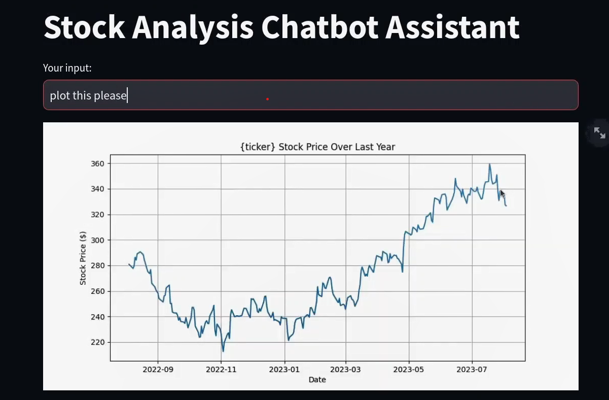

# 📈 Stock Analysis Chatbot Assistant

Unlock the potential of financial insights with our Stock Analysis Chatbot Assistant! This application leverages advanced financial analytics to assist users in evaluating stock performance and making informed investment decisions. By analyzing historical stock data, the chatbot provides key financial indicators, empowering users to optimize their trading strategies.



## Introduction & Objective
Analyzing stock market data is essential for understanding market trends and making strategic investment choices. This project focuses on providing users with vital stock metrics such as current prices, moving averages, and relative strength indices (RSI). Our primary goal is to develop an interactive chatbot that utilizes historical stock data to deliver accurate financial insights and recommendations.

## Features & Data Preprocessing
The application utilizes the Yahoo Finance API to retrieve real-time stock data, offering the following functionalities:

- Get the latest stock price for a given ticker symbol.
- Calculate Simple Moving Average (SMA) for a specified window.
- Calculate Exponential Moving Average (EMA) for a specified window.
- Calculate Relative Strength Index (RSI).
- Calculate Moving Average Convergence Divergence (MACD).
- Plot stock price over the last year.

### Data Sources:
- Yahoo Finance for stock price data.

### Data Preprocessing Techniques:
- Data retrieval and processing through the Yahoo Finance API.
- Calculation of financial indicators based on historical stock prices.

## Model Selection & Evaluation
The chatbot utilizes function calls to calculate various stock indicators, ensuring users receive accurate and up-to-date information based on their queries.

## How to Run the Project
1. **Fork the repository to your local machine.**
2. **Install Python 3.10** and all additional dependencies listed in `requirements.txt` using the command:
   ```bash
   pip install -r ./requirements.txt
   ```
3. **Set up your environment**:
   - Create a `.env` file in the root directory and add your API key as follows:
     ```
     API_KEY=your_api_key_here
     ```
4. **Run the Streamlit app** from the terminal using the command:
   ```bash
   streamlit run app.py
   ```
   The Streamlit app will be hosted on `localhost:8501`.

## Contribute
We welcome contributions from the developer community! Feel free to fork the repository, submit issues, and create pull requests to enhance this project further.

Embark on your financial analysis journey with our Stock Analysis Chatbot Assistant! 📊🚀
